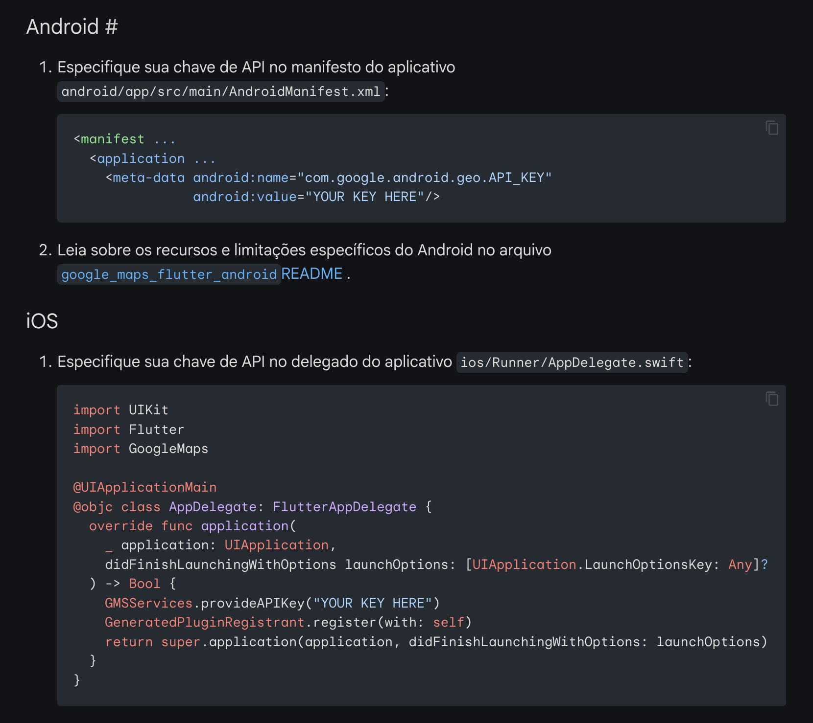

## Objetivo
- Exibir o mapa no Android (Google Maps)
- Usar o pacote: `google_maps_flutter`

---
Passos para integrar o Google Maps
* Ler/Pesquisar a documentação
    - Entender como instalar

* Como executar o pacote

* Entender o que é necessário para configurar o pacote
    - Cadastro no Google
    - Entender quais permissões são necessárias
        - Android: AndroidManifest.xml
        - iOS: Info.plist

* Versões mínimas:
    - Android: SDK 24+	
    - iOS: 14+

1. Configurar a plataforma do Google Maps
2. Configurar a API KEY para o Android
3. Configurar a API KEY para o iOS
