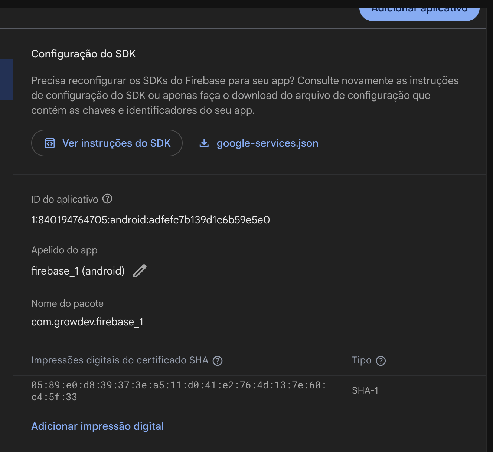

1. Criei o projeto 
2. Instalei a CLI do Firebase (https://firebase.google.com/docs/cli?hl=pt-BR&authuser=0&_gl=1*1ghwgub*_ga*MTc4NTM0OTE4NC4xNzM5ODIzMTIy*_ga_CW55HF8NVT*czE3NzkyMjk2MzEkbzM3NSRnMSR0MTc3OTIzMjc2MiRqNjAkbDAkaDA.#install_the_firebase_cli)
    2.1. Fazer o login no Firebase (`firebase login`) — No terminal
    2.2. Testar a listagem de projetos (`firebase projects:list`)
3. Instalar e executar o FlutterFire (`dart pub global activate flutterfire_cli`)
4. Configurar as variáveis de ambiente:
    Linux/Mac: `export PATH="$PATH":"$HOME/.pub-cache/bin"`
    Windows: Engtrar nas variáveis do sistema, adicionar o caminho mostrado no terminal no `Path` do usuário (clicar nela e adicionar a linha)
5. `flutterfire configure --project={ID-DO-SEU-PROJETO}`

<!-- Até aqui instalamos o Firebase dentro do projeto -->
<!-- Agora vamos configurar o Firebase no projeto -->

6. Configure o Firebase
    6.1. Adicione a linha de inicialização do Firebase no `main.dart`
    ```dart
    await Firebase.initializeApp(
        options: DefaultFirebaseOptions.currentPlatform,
    );
    ```
    6.2. Adicione o `firebase_core` no `pubspec.yaml`

    6.3. Ajuste os erros de importação no `main`
    ```dart
    import 'package:firebase_1/firebase_options.dart';
    import 'package:firebase_core/firebase_core.dart';

    ...

    void main() async {
        await Firebase.initializeApp(options: DefaultFirebaseOptions.currentPlatform);

        runApp(const MainApp());
    }
    ```

---

## Firebase Authentication (Google)
1. Gerar assinatura SHA-1 para o App 
    - https://developer.android.com/studio/publish/app-signing?authuser=0&hl=pt-br
2. Adicionar o SHA-1 nas configurações da plataforma (Android)
    
3. Como conectar o Firebase Authentication
    - https://firebase.google.com/docs/auth/flutter/start?hl=pt-BR&authuser=0#connect_your_app_to_firebase
4. Como conectar via Identidade Federada (Google)
    - https://firebase.google.com/docs/auth/flutter/federated-auth?hl=pt-BR&authuser=0

---

Caso faça a inicialização acima do `runApp`, lembre de fazer o vínculo da plataforma antes de inicializar o Firebase, com `WidgetsFlutterBinding.ensureInitialized()` ou o próprio `runApp(...)`
